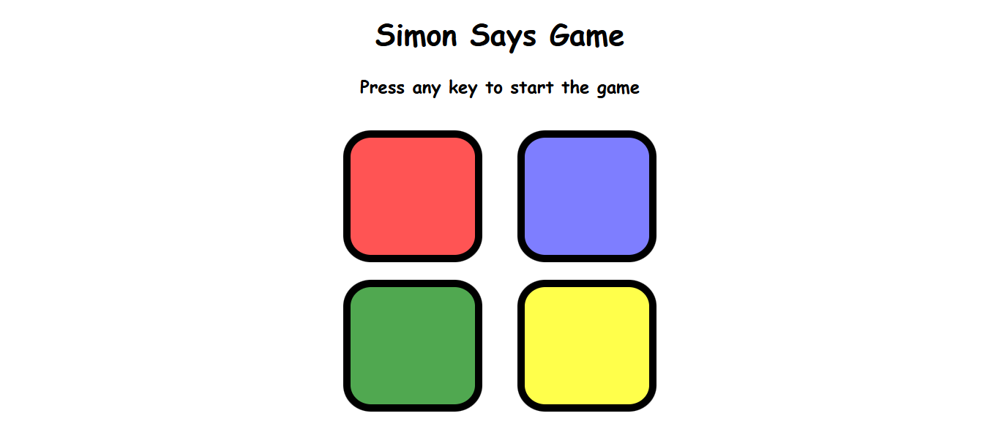

# Simon Says Game

An interactive memory game built using **HTML, CSS, and JavaScript**. The game generates a random sequence of colored buttons that the player must remember and repeat correctly. With each level, a new color is added to the sequence, making the game progressively more challenging.

## 🎮 Live Demo

```text
https://simon-says0.netlify.app
```
---

## 📸 Preview


```text


```

---

## 🚀 Features

* Random color sequence generation
* Level-based progression
* Visual button animations
* User input validation
* Game over detection
* Restart functionality
* Responsive and simple UI
* Built entirely with Vanilla JavaScript

---

## 🛠️ Technologies Used

* HTML5
* CSS3
* JavaScript (ES6)

---

## 🎯 How to Play

1. Open the game in your browser.
2. Press any key to start.
3. Watch the highlighted color.
4. Click the colors in the same order shown by the game.
5. Each new level adds another color to the sequence.
6. If you click the wrong color, the game ends.
7. Press any key to restart and try again.

---

## 📂 Project Structure

```text
Simon-Says-Game/
│
├── index.html
├── style.css
├── app.js
└── README.md
```

---

## 🧠 Game Logic

### Starting the Game

The game starts when the user presses any key.

```javascript
document.addEventListener("keypress", function () {
    if (started == false) {
        started = true;
        levelUp();
    }
});
```

### Generating Random Colors

A random color is selected from an array of available colors.

```javascript
let randIndex = Math.floor(Math.random() * btns.length);
let randColor = btns[randIndex];
```

### Sequence Tracking

* `gameSeq` stores the sequence generated by the game.
* `userSeq` stores the sequence entered by the user.

```javascript
let gameSeq = [];
let userSeq = [];
```

### Answer Validation

Each user click is checked against the game's sequence.

```javascript
checkAns(userSeq.length - 1);
```

If the sequence matches completely, the next level begins.

---

## 🎨 Color Mapping

| Color  | Button ID |
| ------ | --------- |
| Red    | red       |
| Green  | green     |
| Blue   | blue      |
| Yellow | yellow    |

---

## 🔮 Future Improvements

* Add sound effects for each button
* Store high scores using Local Storage
* Add difficulty levels
* Mobile touch optimization
* Dark mode support
* Leaderboard system

---

## 📚 What I Learned

This project helped me practice:

* DOM Manipulation
* Event Handling
* Arrays and Loops
* JavaScript Functions
* CSS Animations
* Game Logic Development
* State Management

---

## 👨‍💻 Author

**Abhijeet Jha**

A frontend developer passionate about building interactive web applications and improving JavaScript skills through hands-on projects.

---

## 📄 License

This project is open-source and available under the MIT License.
"# Simon-Says-Game-" 
